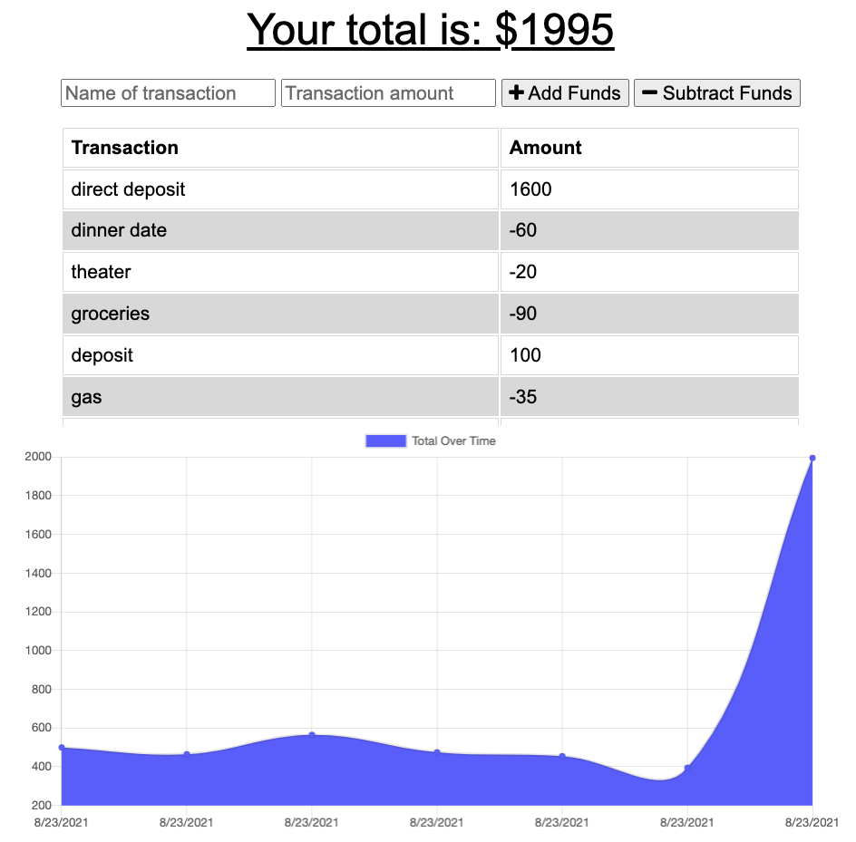

# pwa-budget-tracker

  [](https://github.com/johnsonr84)
  [](https://github.com/johnsonr84/pwa-budget-tracker)
  [](https://github.com/johnsonr84/pwa-budget-tracker)
  [](https://choosealicense.com/licenses/mit/)

  ## Table of Contents 
  * [Description](#Description)
  * [User Story](#UserStory)
  * [Project URL](#Project-URL)
  * [Deplyment](#Deployment)
  * [Mock-up](#Mock-up)
  * [Technologies](#Technologies)
  * [Installation](#Installation)
  * [Usage](#Usage)
  * [Credits](#Credits)
  * [License](#License)
  * [Features](#Features)
  * [Tests](#Tests)
  * [Resources](#Resources)
  * [Contact](#Contact)
  * [Designed and built by](#Designed-and-built-by)
  #
  
  ## Description 
  A PWA Budget Tracker application that allows for offline access and functionality.
  * The user will be able to add expenses and deposits to their budget with or without a connection.
  * When entering transactions offline, offline-entries will be added to tracker when brought back online.

  ## UserStory 
  
  AS AN avid traveller
  I WANT to be able to track my withdrawals and deposits with or without a data/internet connection
  SO THAT my account balance is accurate when I am traveling
  
  ## Acceptance Criteria
   
  GIVEN a user is on Budget App without an internet connection
  WHEN the user inputs a withdrawal or deposit
  THEN that will be shown on the page, and added to their transaction history when their connection is back online.
  
  ## Project URL
  https://github.com/johnsonr84/pwa-budget-tracker

  ## Deployment
  coming soon!

  ## Mock-Up
  <table>
    <tr>
      <td>pwa-budget-tracker example</td>
    </tr>
    <tr>
      <td></td>
    </tr>
  </table>

  ## Technologies 
  ```
  PWA (Manifest, ServiceWorker), Mongodb, Mongoose, IndexDB Storage, Node.js, Javascript, HTML5, CSS3 
  ```

  ## Installation 
   Access to GitHub.com and a code editor such as vscode is necessary. Click the GitHub link provided above to the APP REPO. Click on the green button that says Clone or Download and Choose how you would like to download: using the SSH/HTTPS keys or download the zip file. If using SSH/HTTPS Key: You will copy the link shown and open up either terminal (mac: pre-installed) or gitbash (pc: must be installed). Once the application is open, you will type git clone paste url here. If using Download ZIP: Click on Download Zip. Locate the file and double click it to unzip the file. Locate the unzipped folder and open it. 

  ## Usage 
  In order to use this APP, you need terminal (mac: pre-installed) or gitbash (pc: must be installed). You also need to download and install [node.js](https://nodejs.org/en/) and [npm](www.npmjs.com) or [yarn](https://yarnpkg.com/) package manager. Open the cloned REPO in your favorite code editor, and then in terminal, enter the command “npm i“ or “yarn add”  to install the dependencies. You will also need to signup for a free account at [mongodb.com](https://www.mongodb.com/). In addition, make sure to create a .env file on the project root, and input your own mongodb Atals config information (see .env_example for samples). You also need to obtain a Google Book API Key [link here](https://developers.google.com/books/docs/v1/getting_started) and replace process.env.REACT_APP_BOOK_API_KEY in src/Search/Search.js file with you own API KEY. Now you are ready to start using  the app by entering “npm start” on your terminal or gitbash. If you just want to try how the app works, you can go to the link [here](https:)

  ## Credits 
  Me, myself and Irene 

  ## License 
  This project is [mit](https://choosealicense.com/licenses/mit/) licensed.

  ## Features
  Coming soon maybe 

  ## Tests
  npm test 

  ## Resources
  * [Choose a License](https://choosealicense.com/)
  * [Badmath](https://img.shields.io/github/languages/top/nielsenjared/badmath)
  * [shields.io](https://shields.io/)
  * [w3schools](https://www.w3schools.com/)
  * [stackoverflow.com](https://stackoverflow.com/)
  * [YouTube](https://www.youtube.com/)
  * [Google](https://www.google.com)
  * [IndexDB](https://javascript.info/indexeddb)
  * [18-PWA-Activities/](18-PWA-Activities/)
  * [Deployment Guide](./MongoDBDeploy.md)
  * [Heroku](https://www.heroku.com)
  * [Heroku and MongoDB Atlas.](../04-Important/MongoAtlas-Deploy.md)


  ## Contact
  Email: robertcjohnson1984@gmail.com 

  ## Designed and built by
  Author(s): Rob Johnson  

  GitHub: https://github.com/johnsonr84/ 